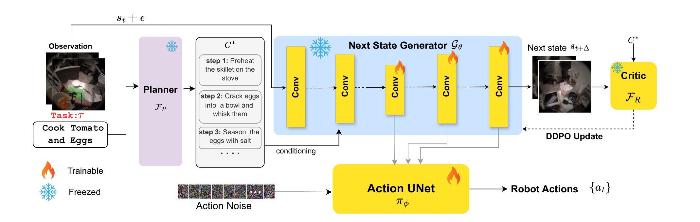

# Simulate, Reason, Act: Hierarchical Planning with Generative Rollouts
### CSE-291 Final Project

[Hanan Gani](https://hananshafi.github.io/), [Tejal Kulkarni](https://scholar.google.com/citations?user=j1Sh_joAAAAJ&hl=en), [Shengxiang Ji](https://scholar.google.com/citations?user=taEqnmcAAAAJ&hl=en) [Yanran Wang](https://www.linkedin.com/in/yanran-wang-38738022b/) [Madhoolika Chodavarapu](https://www.linkedin.com/in/madhoolikac/)

 Department of Computer Science, University of California, San Diego

<p align="center">
  
</p>

##  Usage
###  🛠️ Install Dependencies

Create environment:
```
git clone https://github.com/CSE291A-25Fall-Project-Team/Reasoning-Guided-Diffusion-World-Models.git
conda create -n videopolicy python=3.10
conda activate videopolicy
```
Install simulation environment:
```
cd packages && \
git clone -b robocasa https://github.com/ARISE-Initiative/robomimic && pip install -e robomimic && \
git clone https://github.com/ARISE-Initiative/robosuite && pip install -e robosuite && \
git clone https://github.com/robocasa/robocasa && pip install -e robocasa && \
python robocasa/robocasa/scripts/download_kitchen_assets.py && \
python robocasa/robocasa/scripts/setup_macros.py
```
Install python packages:
```
cd ..
pip install -r requirements.txt
```

### 🧾 Download Checkpoints and Datasets

Download pretrained checkpoints, move files to `checkpoints` folder under the `video_model` folder:
```
https://huggingface.co/hanangani/rgb-wm-ckpts
```
Download simulation dataset, extract and move `datasets` under the `video_model` folder:
```
wget https://videopolicy.cs.columbia.edu/assets/datasets.zip
```

### 🖥️ Run Evaluation

After downloading the pretrained checkpoints and the simulation dataset, you can run the Robocasa evaluations from the `video_model` folder:

```
CUDA_VISIBLE_DEVICES=0 PYTHONPATH=. python scripts/sampling/robocasa_experiment.py --config=scripts/sampling/configs/svd_xt.yaml
```
This will run evaluation on one of the 24 tasks defined in `svd_xt.yaml`. To run on another task, please run this command again on a different gpu.


### 🖥️ Compute Success Rate

After running the evaluations, you can compute the success rate by running the below script from `video_model` folder with the evaluated json file:

```
python eval_script.py experiments/example_inference/multi_environment_experiment_record.json
```
This will compute and print the success rate for all the completed tasks in the json file.

### 🚀 Run Training

Run below command to start the training, adjust the GPUs accordingly

```
PYTHONPATH=. CUDA_VISIBLE_DEVICES=0,1 python main.py --base=configs/joint_training.yaml --name=ft1 --seed=24 --num_nodes=1 --wandb=1 lightning.trainer.devices="0,1"
```

Larger batch size tends to improve model performance when compute and resources are available.


## 🙏 Acknowledgement
This repository is based on [VideoPolicy](https://github.com/cvlab-columbia/videopolicy/tree/master). We would like to thank the authors of these work for publicly releasing their code. 

<!-- 
##  Citation
```
@article{liang2025video,
  title={Video Generators are Robot Policies}, 
  author={Liang, Junbang and Tokmakov, Pavel and Liu, Ruoshi and Sudhakar, Sruthi and Shah, Paarth and Ambrus, Rares and Vondrick, Carl},
  journal={arXiv preprint arXiv:2508.00795},
  year={2025}
}
``` -->
